# 3420 Assignment #1 - Summer 2022

Name(s): Michael Salemi

Live Loki link(s): 
all pages accessible through index\
index: https://loki.trentu.ca/~michaelsalemi/3420/assignments/Assignment_MAIN_MichaelSalemi/html/\
addbook: https://loki.trentu.ca/~michaelsalemi/3420/assignments/Assignment_MAIN_MichaelSalemi/html/addbook.html\
search: https://loki.trentu.ca/~michaelsalemi/3420/assignments/Assignment_MAIN_MichaelSalemi/html/search.html\
login: https://loki.trentu.ca/~michaelsalemi/3420/assignments/Assignment_MAIN_MichaelSalemi/html/login.html\
forgot: https://loki.trentu.ca/~michaelsalemi/3420/assignments/Assignment_MAIN_MichaelSalemi/html/forgot.html\
register: https://loki.trentu.ca/~michaelsalemi/3420/assignments/Assignment_MAIN_MichaelSalemi/html/register.html\
details: https://loki.trentu.ca/~michaelsalemi/3420/assignments/Assignment_MAIN_MichaelSalemi/html/details.html\
editbook: https://loki.trentu.ca/~michaelsalemi/3420/assignments/Assignment_MAIN_MichaelSalemi/html/editbook.html\

## Rubric

| Component                                                    | Grade |
| :----------------------------------------------------------- | ----: |
| Page Wrappers (header, footer, nav, overall design)          |    /5 |
| Design Complexity                                            |   /10 |
| Create Account                                               |    /3 |
| Login                                                        |    /3 |
| Forgot Password                                              |    /3 |
| Main Page                                                    |    /3 |
| Add Book                                                     |    /3 |
| Display Details                                              |    /3 |
| Search                                                       |    /3 |
|                                                              |       |
| Code Quality (tidyness, validity, accessability, semantics)  |    /5 |
| Documentation                                                |    /5 |
| Testing                                                      |    /5 |
|                                                              |       |
| Bonus                                                        |       |
| Deductions (readability, submission guidelines, originality) |       |
|                                                              |       |
| Total                                                        |   /51 |

## Table of Contents
- [3420 Assignment #1 - Summer 2022](#3420-assignment-1---summer-2022)
  - [Rubric](#rubric)
  - [Table of Contents](#table-of-contents)
  - [Things to consider for Bonus Marks (if any)](#things-to-consider-for-bonus-marks-if-any)
  - [Create Account](#create-account)
    - [HTML](#html)
    - [Testing](#testing)
      - [HTML Validation](#html-validation)
      - [Browser testing](#browser-testing)
        - [Edge](#edge)
        - [Chrome](#chrome)
        - [Safari](#safari)
        - [Firefox](#firefox)
  - [Login](#login)
    - [HTML](#html-1)
    - [Testing](#testing-1)
      - [HTML Validation](#html-validation-1)
      - [Browser testing](#browser-testing-1)
        - [Edge](#edge-1)
        - [Chrome](#chrome-1)
        - [Safari](#safari-1)
        - [Firefox](#firefox-1)
  - [Forgot Password](#forgot-password)
    - [HTML](#html-2)
    - [Testing](#testing-2)
      - [HTML Validation](#html-validation-2)
      - [Browser testing](#browser-testing-2)
        - [Edge](#edge-2)
        - [Chrome](#chrome-2)
        - [Safari](#safari-2)
        - [Firefox](#firefox-2)
  - [Main Page](#main-page)
    - [HTML](#html-3)
    - [Testing](#testing-3)
      - [HTML Validation](#html-validation-3)
      - [Browser testing](#browser-testing-3)
        - [Edge](#edge-3)
        - [Chrome](#chrome-3)
        - [Safari](#safari-3)
        - [Firefox](#firefox-3)
  - [Add Book](#add-book)
    - [HTML](#html-4)
    - [Testing](#testing-4)
      - [HTML Validation](#html-validation-4)
      - [Browser testing](#browser-testing-4)
        - [Edge](#edge-4)
        - [Chrome](#chrome-4)
        - [Safari](#safari-4)
        - [Firefox](#firefox-4)
  - [Display Details](#display-details)
    - [HTML](#html-5)
    - [Testing](#testing-5)
      - [HTML Validation](#html-validation-5)
      - [Browser testing](#browser-testing-5)
        - [Edge](#edge-5)
        - [Chrome](#chrome-5)
        - [Safari](#safari-5)
        - [Firefox](#firefox-5)
  - [Search](#search)
    - [HTML](#html-6)
    - [Testing](#testing-6)
      - [HTML Validation](#html-validation-6)
      - [Browser testing](#browser-testing-6)
        - [Edge](#edge-6)
        - [Chrome](#chrome-6)
        - [Safari](#safari-6)
        - [Firefox](#firefox-6)
  - [Styles](#styles)
    - [main.css](#maincss)
    - [reset.css](#resetcss)


## Things to consider for Bonus Marks (if any)
-content is cnosistent on all tested browsers\
-no css properties are overridden unintentionally\
-minimal inline css for readability\
-stylesheet is organized into sections for ease of access\
-all pages have consistent styling an dofrmatting for positive UX\
-some custom anumations on pages (scaling on hover)\
-custom created hi-res png company logo\
-utilization of a variety of css selectors to achieve specific formatting and patterns for automation when pages become modular with JS and PHP (html attribute selection, nth child)\
-limited number of classes and ids in order to keep code reuseable, mudular, and easy to edit\
-all pages have a flavicon for extra flavour

## Create Account

### HTML

```html
<!--
register.html
-accessible via login page
-ensures that username and email do not beling to another account
-ensures password is relatively strong
-->
<!doctype html>
<html lang="en">
<head>
    <meta charset="UTF-8">
    <title>Book Box - Register</title>
    <link rel="icon" type="image/x-icon" href="../images/bookBoxIcon.ico">
    <script src="https://kit.fontawesome.com/ab6b9559bc.js" crossorigin="anonymous"></script>
    <link rel="stylesheet" href="../styles/main.css">

</head>
<body>
<header>
    <div id="headerTitle">
        <a href="./index.html"></a>
        <h2>Your personal book depository</h2>
    </div>
    <div id="headerBox2">
        <a href="">
            
            <h3>testUser</h3>
        </a>
        <nav>
            <div><a href="./addbook.html">Add Book</a> | <a href="./search.html">Search</a> | <a href="./login.html">Logout</a>
            </div>
        </nav>
    </div>

</header>
<!--submit form to future php-->
<main>
    <form action="future.php" method="post">
        <div id="contentBox">
            <div>
                <div><i class="fa-regular fa-user fa-5x"></i><i class="fa-solid fa-plus fa-3x"></i></div>
                <label for="profile_pic">Profile Picture:</label>
                <!--use js to validate filetype and maximum filesize-->
                <input type="file" name="profile_pic" id="profile_pic" accept=".png,.jpg">
                <!--ensure username is not associated with existing account-->
                <label for="username">Username:</label>
                <input type="text" id="username" name="user" placeholder="username" required>
                <!--ensure email is not associated with existing account-->
                <label for="email">Email:</label>
                <input type="email" id="email" name="email" placeholder="address@email.com" required>
                <!--use js to ensure password has at least 1 upper, 1 lower, 1 number, 1 special, minimum 8 characters-->
                <label for="password1">Password:</label>
                <input type="password" id="password1" name="password1" placeholder="password" required>
                <!--validate that both password fields match using js-->
                <label for="password2">Password:</label>
                <input type="password" id="password2" name="password2" placeholder="password" required>
            </div>
            <div>
                <label for="name">Name:</label>
                <input type="text" id="name" name="name" placeholder="John Doe" required>
                <label for="address">Address:</label>
                <input type="text" id="address" name="address" placeholder="123 Sesame Street" required>

                <!--uses regex to validate phonenumber-->
                <div style="display: flex">
                    <div>
                        <label for="phone">Phone:</label>
                        <input type="text" id="phone" name="phone" placeholder="6789998212" pattern="^[0-9]{10}$"
                               required>
                    </div>
                    <div>
                        <label for="phontType">Type:</label>
                        <select name="phonetype" id="phontType" required>
                            <option selected disabled value="">---</option>
                            <option value="cell">Cell</option>
                            <option value="home">Home</option>
                            <option value="work">Work</option>
                            <option value="other">Other</option>
                        </select>
                    </div>
                </div>
                <fieldset>
                    <legend>Favourite Genres:</legend>

                    <div><input type="checkbox" id="mystery" name="genre" value="mystery">
                        <label for="mystery">Mystery</label></div>

                    <div><input type="checkbox" id="sci_fi" name="genre" value="sci_fi">
                        <label for="sci_fi">Sci-Fi</label></div>

                    <div> <input type="checkbox" id="romance" name="genre" value="romance">
                        <label for="romance">Romance</label></div>

                    <div><input type="checkbox" id="non_fiction" name="genre" value="non_fiction">
                        <label for="non_fiction">Non-Fiction</label></div>

                    <div><input type="checkbox" id="educational" name="genre" value="educational">
                        <label for="educational">Educational</label></div>

                    <div><input type="checkbox" id="history" name="genre" value="history">
                        <label for="history">History</label></div>
                </fieldset>
                <input type="submit" name="submit" id="submit" style="align-self: end">
            </div>
        </div>
    </form>
</main>
<footer>
    <span>&copy; Michael Salemi - COIS 3420 - Assignment 1 - 2023</span>
</footer>
</body>
</html>
```

### Testing

#### HTML Validation
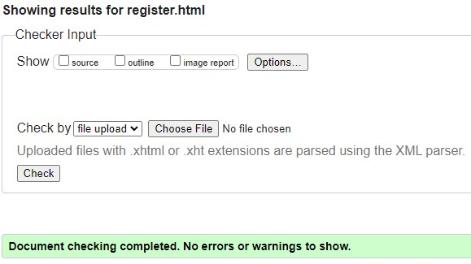
#### Browser testing

##### Edge
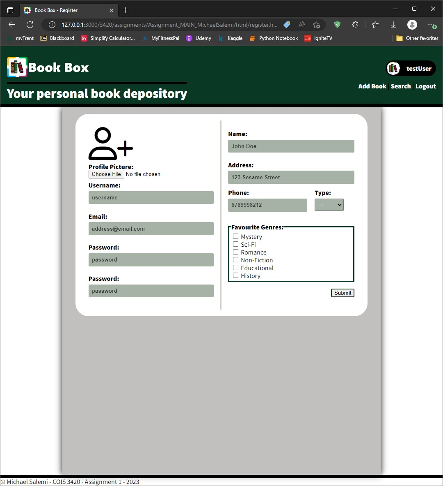
No issues.

##### Chrome
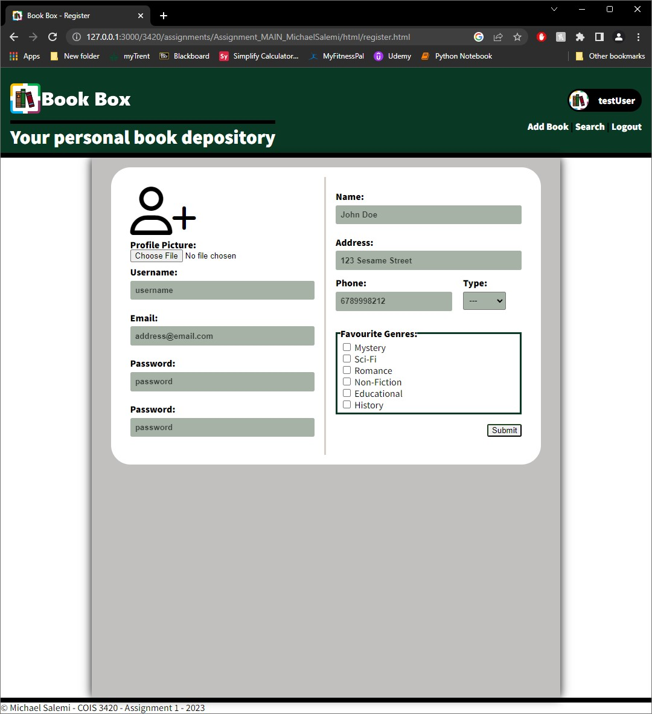
No issues.

##### Safari

No issues.

##### Firefox
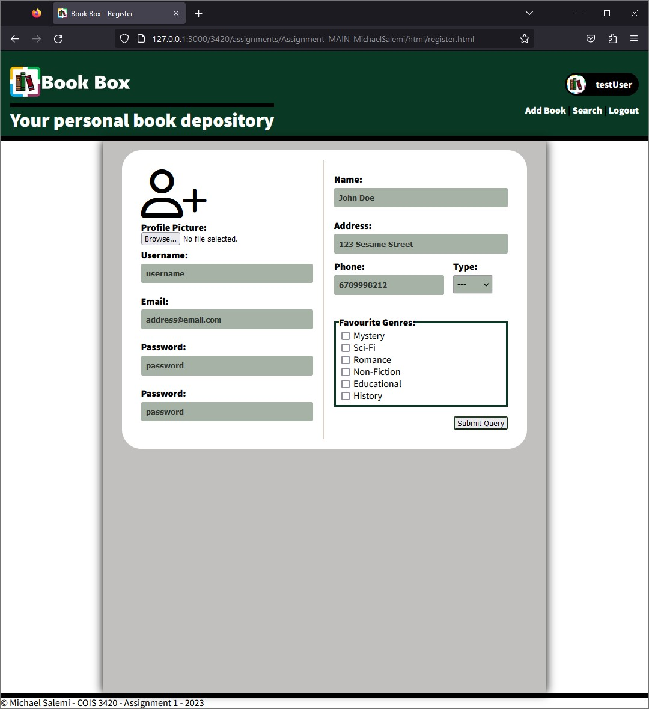
No issues.

## Login

### HTML

```html
<!--
login.html
-accessible via homepage
-option to create account and recover password are available through this page
-->
<!doctype html>
<html lang="en">
<head>
    <meta charset="UTF-8">
    <script src="https://kit.fontawesome.com/ab6b9559bc.js" crossorigin="anonymous"></script>
    <title>Book Box - Login</title>
    <link rel="icon" type="image/x-icon" href="../images/bookBoxIcon.ico">
    <link rel="stylesheet" href="../styles/main.css">

</head>
<body>
    <header>
        <div id="headerTitle">
            <a href="./index.html"></a>
            <h2>Your personal book depository</h2>
        </div>
        <div id="headerBox2">
            <a href="">
                
                <h3>testUser</h3>
            </a>
            <nav>
                <div><a href="./addbook.html">Add Book</a> | <a href="./search.html">Search</a> | <a href="./login.html">Logout</a>
                </div>
            </nav>
        </div>
    </header>
    <main>
        <h2>Login</h2>
        <div id="contentBox">
            <div class="doubleGrid" style="flex-direction: column;">
                <i class="fa-solid fa-house-user fa-5x"></i>
                <!--submit form to future php-->
                <form action="future.php" method="post">
                    <div>
                        <label for="username">Username:</label>
                    </div>
                    <div>
                        <input required type="text" id="username" name="username" placeholder="username">
                    </div>
                    <div>

                        <label for="password">Password:</label>
                    </div>
                    <div>
                        <input required type="password" id="password" name="password" placeholder="password">
                    </div>
                    <div>
                        <label for="remember">Remember me:</label>
                        <input type="checkbox" name="remember" id="remember" value="true">
                        <input type="submit">
                    </div>
                    <nav>
                        <div>
                            <a href="./forgot.html">Forgot password?</a>
                        </div>
                        <div>
                            <a href="./register.html">Create Account</a>
                        </div>
                    </nav>
                </form>
            </div>
        </div>
    </main>
<footer>
    <span>&copy; Michael Salemi - COIS 3420 - Assignment 1 - 2023</span>
</footer>
</body>
</html>
```

### Testing

#### HTML Validation

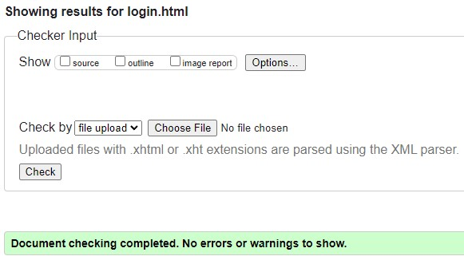

#### Browser testing

##### Edge
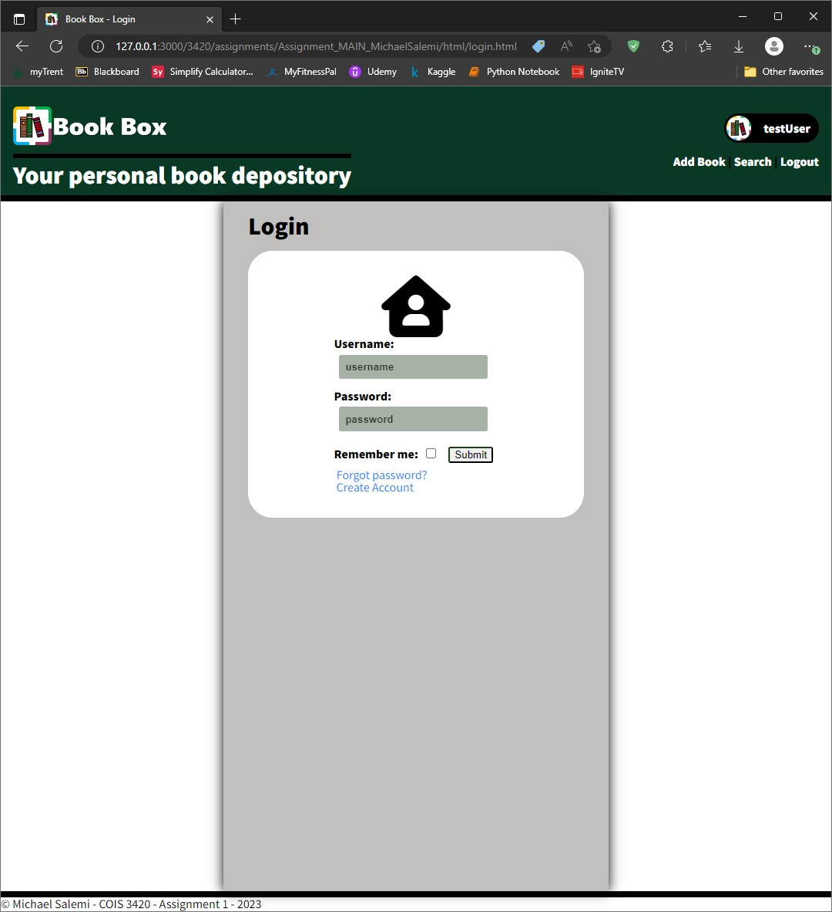
No issues.

##### Chrome
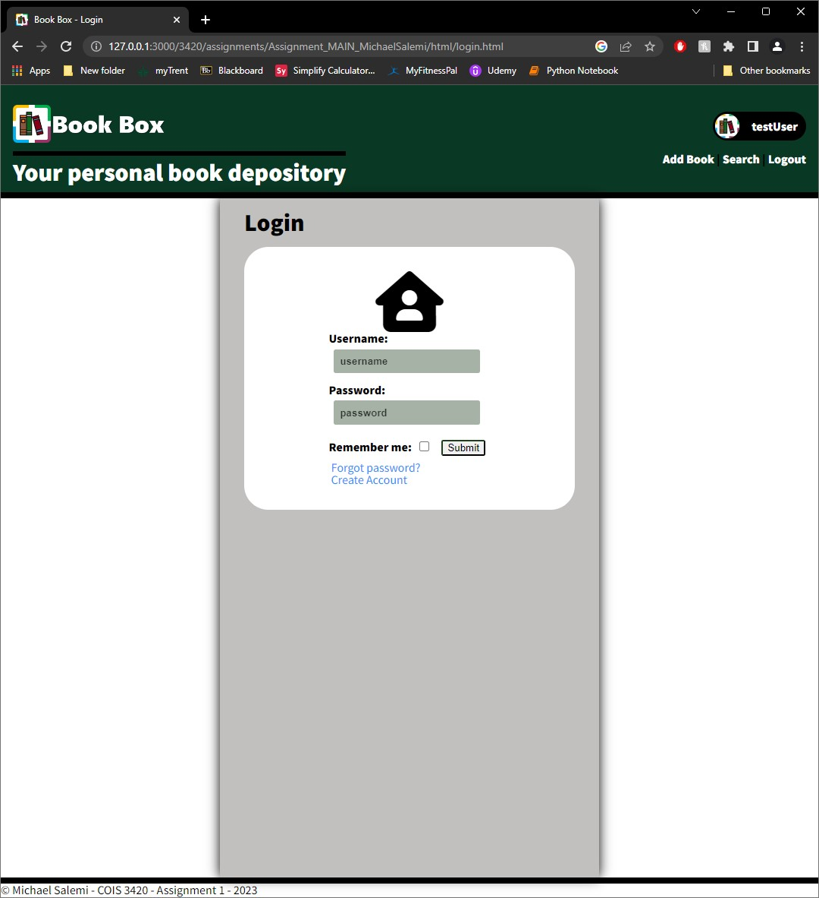
No issues.

##### Safari

No issues.

##### Firefox
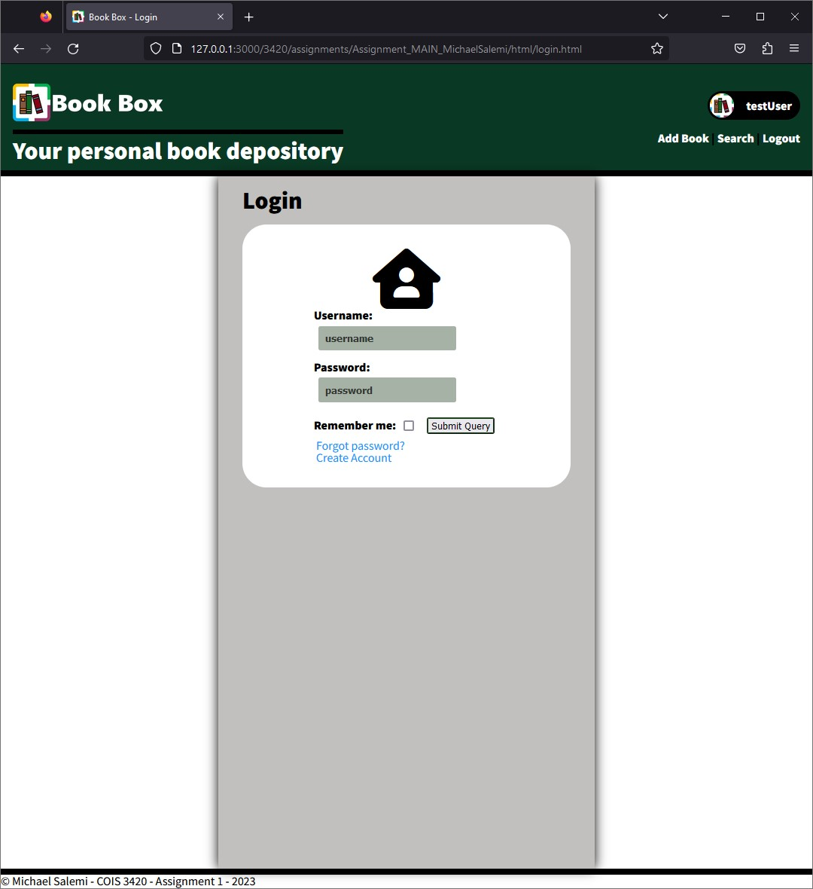
No issues.


## Forgot Password

### HTML

```html
<!--
forgot.html
-only accessible via login page
-users will input either their username or email address and an email will be sent to the associated email address on record
-there will be no prompt of an unsuccessful attempt to limit guesses from unauthorized users
-->
<!doctype html>
<html lang="en">

<head>
    <meta charset="UTF-8">
    <script src="https://kit.fontawesome.com/ab6b9559bc.js" crossorigin="anonymous"></script>
    <title>Book Box - Forgot Password</title>
    <link rel="icon" type="image/x-icon" href="../images/bookBoxIcon.ico">
    <link rel="stylesheet" href="../styles/main.css">

</head>

<body>
    <header>
        <div id="headerTitle">
            <a href="./index.html"></a>
            <h2>Your personal book depository</h2>
        </div>
        <div id="headerBox2">
            <a href="register.html">
                
                <h3>testUser</h3>
            </a>
            <nav>
                <div>
                    <a href="./addbook.html">Add Book</a> | <a href="./search.html">Search</a> | <a
                        href="./login.html">Logout</a>
                </div>
            </nav>
        </div>

    </header>
    <main>
        <div><i class="fa-solid fa-person-circle-question fa-5x"></i>
            <h2>Forgot your password?</h2>
        </div>
        <div id="contentBox">
            <!--submit form to future php-->
            <form action="future.php" method="post" class="doubleGrid">
                <div>
                    <p>
                        Enter the username or email you signed up with and a recovery message will be sent to your email
                        address
                        on file.
                    </p>
                </div>
                <div>
                    <label for="recovery">Username/Email:</label>
                    <!--same search field to be used for either username or email lookup-->
                    <input required type="text" id="recovery" name="recovery" placeholder="username/email">
                    <input type="submit">
                </div>
                <div>
                </div>
            </form>
        </div>
    </main>
    <footer>
        <span>&copy; Michael Salemi - COIS 3420 - Assignment 1 - 2023</span>
    </footer>
</body>

</html>
```

### Testing

#### HTML Validation
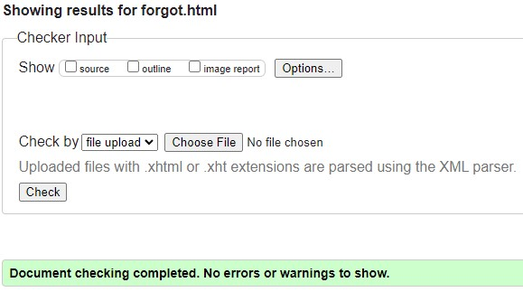

#### Browser testing

##### Edge

No issues

##### Chrome
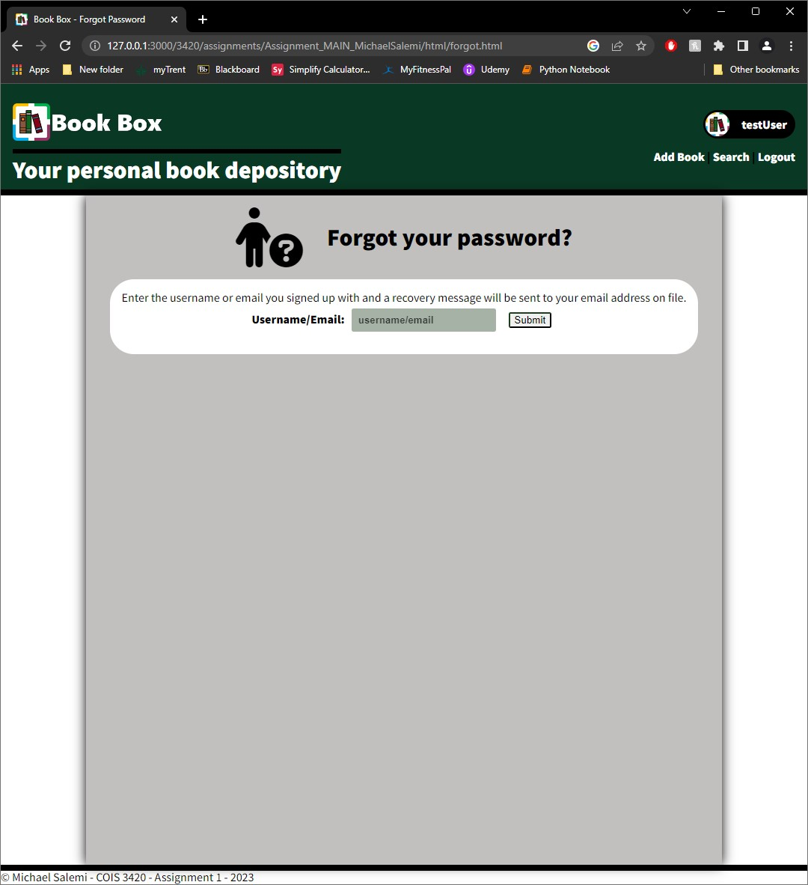
No issues

##### Safari

No issues

##### Firefox

No issues


## Main Page

### HTML

```html
<!--
index.html
-page that is visible as either the users personal home page or a general page with a redirect to login/registration
-will display a grid of the user's books with an option to add another book
-details below are currently hard coded for layout selection
-grid will span multiple "pages" in order to display numerous books
-->
<!doctype html>
<html lang="en">

<head>
    <meta charset="UTF-8">
    <script src="https://kit.fontawesome.com/ab6b9559bc.js" crossorigin="anonymous"></script>
    <title>Book Box - Home</title>
    <link rel="icon" type="image/x-icon" href="../images/bookBoxIcon.ico">
    <link rel="stylesheet" href="../styles/main.css">
</head>

<body>
    <header>
        <div id="headerTitle">
            <a href="./index.html"></a>
            <h2>Your personal book depository</h2>
        </div>
        <div id="headerBox2">
            <a href="register.html">
                
                <h3>testUser</h3>
            </a>
            <nav>
                <div><a href="./addbook.html">Add Book</a> | <a href="./search.html">Search</a> | <a
                        href="./login.html">Logout</a>
                </div>
            </nav>
        </div>
    </header>
    <main>
        <h2>Your Collection</h2>
        <div id="contentBox">
            <div class="bookbox">
                
                <div>
                    <h3>The Catcher in the Rye</h3>
                    <h4>J. D. Salinger</h4>
                    <nav>
                        <a href="./details.html">Details</a> <a href="./addbook.html">Edit</a> <a href="">Delete</a>
                    </nav>
                </div>
            </div>
            <div class="bookbox">
                
                <div>
                    <h3>The Adventures of Huckleberry Finn</h3>
                    <h4>Mark Twain</h4>

                    <nav>
                        <a href="./details.html">Details</a> <a href="./addbook.html">Edit</a> <a href="">Delete</a>
                    </nav>
                </div>
            </div>
            <div class="bookbox">
                
                <div>
                    <h3>Cracking the Coding Interview</h3>
                    <h4>Gayle Laakmann McDowell</h4>
                    <nav>
                        <a href="./details.html">Details</a> <a href="./addbook.html">Edit</a> <a href="">Delete</a>
                    </nav>
                </div>
            </div>
            <div class="bookbox">
                
                <div>
                    <h3>The Book of Mormon</h3>
                    <h4>Joseph Smith</h4>
                    <nav>
                        <a href="./details.html">Details</a> <a href="./addbook.html">Edit</a> <a href="">Delete</a>
                    </nav>
                </div>
            </div>
        </div>
    </main>
    <footer>
        <span>&copy; Michael Salemi - COIS 3420 - Assignment 1 - 2023</span>
    </footer>
</body>

</html>
```

### Testing

#### HTML Validation
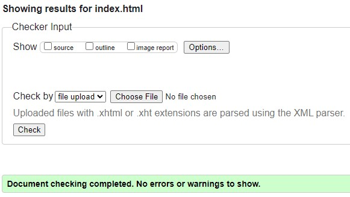

#### Browser testing

##### Edge
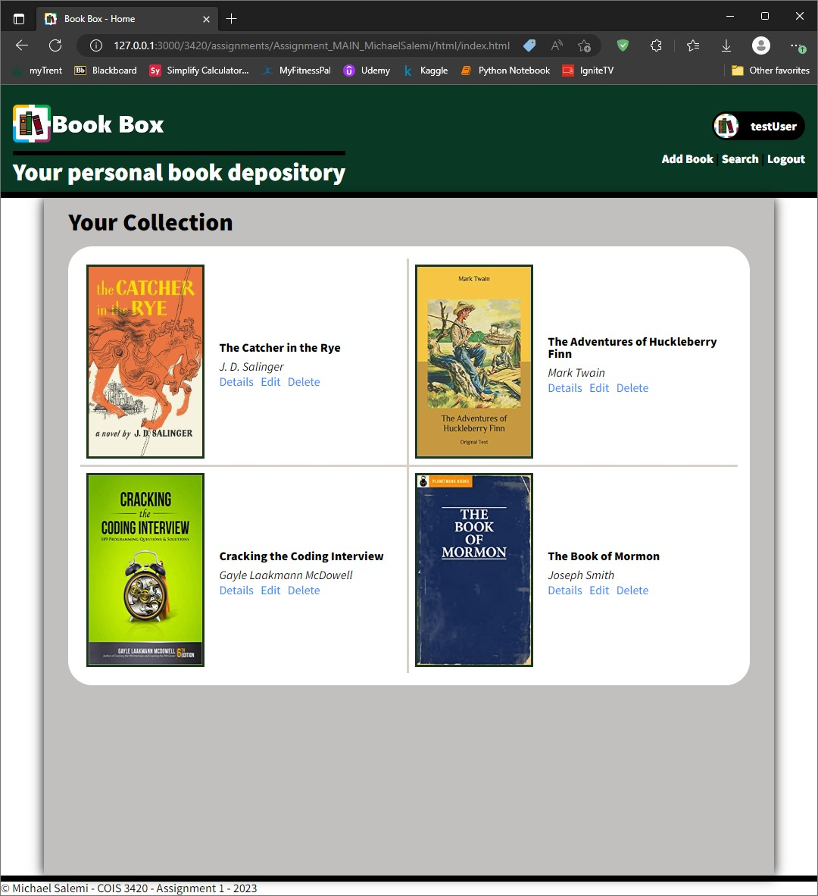

##### Chrome


##### Safari


##### Firefox
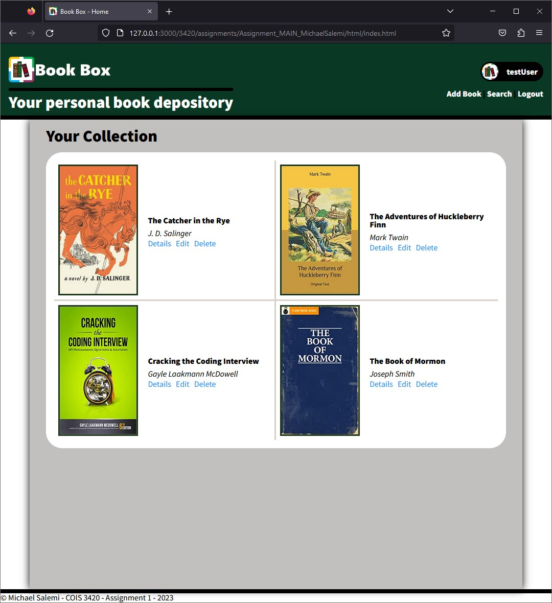


## Add Book

### HTML

```html
<!--
addbook.html
-users will use this page to add a book to their collection
-all required form fields will be used in search, including description
-regex is used for ISBN validation
-->
<!DOCTYPE html>
<html lang="en">

<head>
    <meta charset="UTF-8" />
    <title>Book Box - Add Book</title>
    <link rel="icon" type="image/x-icon" href="../images/bookBoxIcon.ico" />
    <script src="https://kit.fontawesome.com/ab6b9559bc.js" crossorigin="anonymous"></script>
    <link rel="stylesheet" href="../styles/main.css" />
</head>

<body>
    <header>
        <div id="headerTitle">
            <a href="./index.html"></a>
            <h2>Your personal book depository</h2>
        </div>
        <div id="headerBox2">
            <a href="">
                
                <h3>testUser</h3>
            </a>
            <nav>
                <div>
                    <a href="./addbook.html">Add Book</a> |
                    <a href="./search.html">Search</a> |
                    <a href="./login.html">Logout</a>
                </div>
            </nav>
        </div>
    </header>
    <!--submit form to future php-->
    <main>
        <h2>Add a book</h2>
        <form action="future.php" method="post">
            <div id="contentBox">
                <div>
                    <div style="flex-direction: row; margin-bottom: 1em">
                        <i class="fa-solid fa-book fa-7x"></i><i class="fa-solid fa-plus fa-3x"></i>
                    </div>
                    <fieldset>
                        <!--disable unused input method with js-->
                        <legend>Select Book Cover Photo:</legend>
                        <div>
                            <label for="cover_upload">Upload:</label>
                            <!--requires js for filetype validation-->
                            <input type="file" id="cover_upload" name="bookcover" accept=".png,.jpg" />
                        </div>
                        <div>
                            <label for="cover_url">URL:</label>
                            <input type="url" id="cover_url" name="bookcover" placeholder="URL" />
                        </div>
                    </fieldset>
                    <fieldset>
                        <legend>Book Format:</legend>
                        <!--hardcover option-->
                        <div>
                            <input type="checkbox" id="hardcover" name="book_format" value="hardcover" />
                            <label for="hardcover">Hardcover</label>
                        </div>
                        <!--paperback option-->
                        <div>
                            <input type="checkbox" id="paperback" name="book_format" value="paperback" />
                            <label for="paperback">Paperback</label>
                        </div>
                        <!--epub option-->
                        <div>
                            <input type="checkbox" id="epub" name="book_format" value="epub" />
                            <label for="epub">EPub</label>
                        </div>
                        <!--mobi option-->
                        <div>
                            <input type="checkbox" id="mobi" name="book_format" value="mobi" />
                            <label for="mobi">Mobi</label>
                        </div>
                        <!--pdf option-->
                        <div>
                            <input type="checkbox" id="pdf" name="book_format" value="pdf" />
                            <label for="pdf">PDF</label>
                        </div>
                    </fieldset>
                    <div>
                        <label for="ebook_upload">Ebook Upload:</label>
                        <input type="file" name="ebook_upload" id="ebook_upload" />
                    </div>
                </div>
                <div>
                    <label for="title">Title:</label>
                    <input required type="text" id="title" name="Title" placeholder="Title" />
                    <label for="author">Author:</label>
                    <input required type="text" id="author" name="author" placeholder="Author" />
                    <label for="genre"> Genre:</label>
                    <select required name="genre" id="genre">
                        <option selected disabled value="">---</option>
                        <option value="mystery">Mystery</option>
                        <option value="sci_fi">Sci-Fi</option>
                        <option value="romance">Romance</option>
                        <option value="non_fiction">Non-Fiction</option>
                        <option value="educational">Educational</option>
                        <option value="history">History</option>
                        <option value="other">Other</option>
                    </select>
                    <label for="date">Publication Date:</label>
                    <input required type="date" id="date" name="date" />
                    <label for="isbn">ISBN#:</label>
                    <input required type="text" id="isbn" name="isbn" placeholder="#############"
                        pattern="^[0-9]{10}|[0-9]{13}$" />
                    <label for="rating">Rating:</label>
                    <input type="range" id="rating" name="rating" min="1" max="5" step="0.5" value="3" />
                </div>
                <div class="doubleGrid">
                    <label for="description" style="align-self: start">Description:</label>
                    <textarea required name="description" id="description" rows="10" minlength="20"
                        maxlength="500"></textarea>
                    <input type="submit" style="align-self: end" />
                </div>
                <!--requires js validation on filetype-->
            </div>
        </form>
    </main>
    <footer>
        <span>&copy; Michael Salemi - COIS 3420 - Assignment 1 - 2023</span>
    </footer>
</body>

</html>
```

### Testing

#### HTML Validation
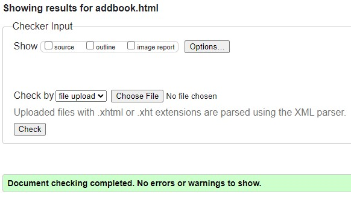

#### Browser testing

##### Edge
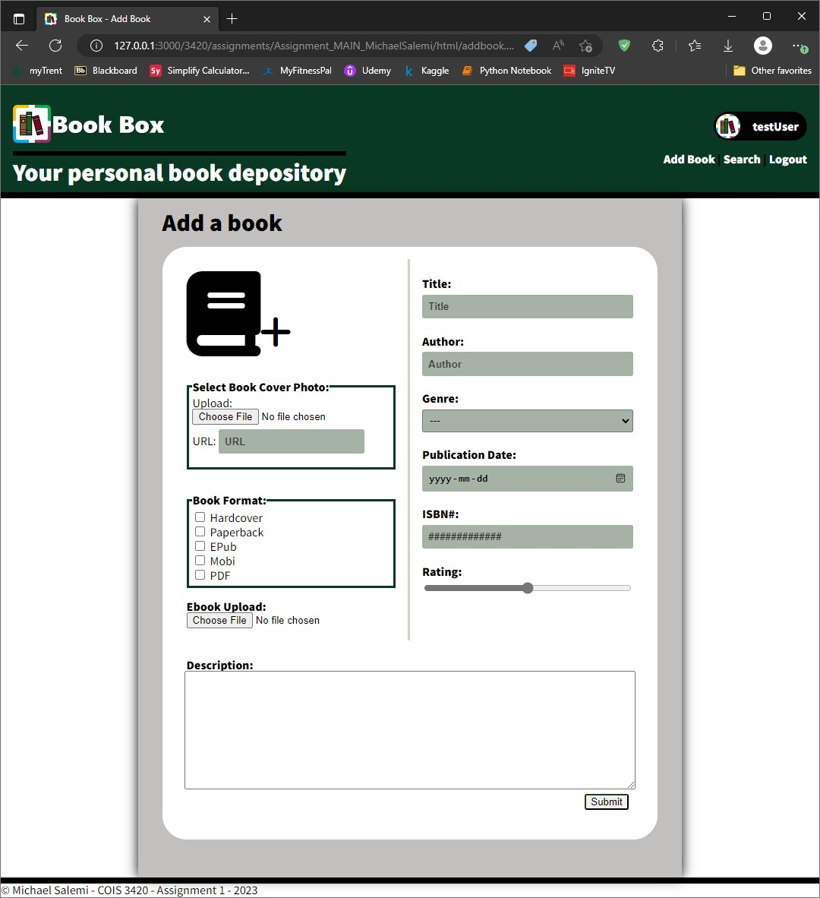
No issues

##### Chrome
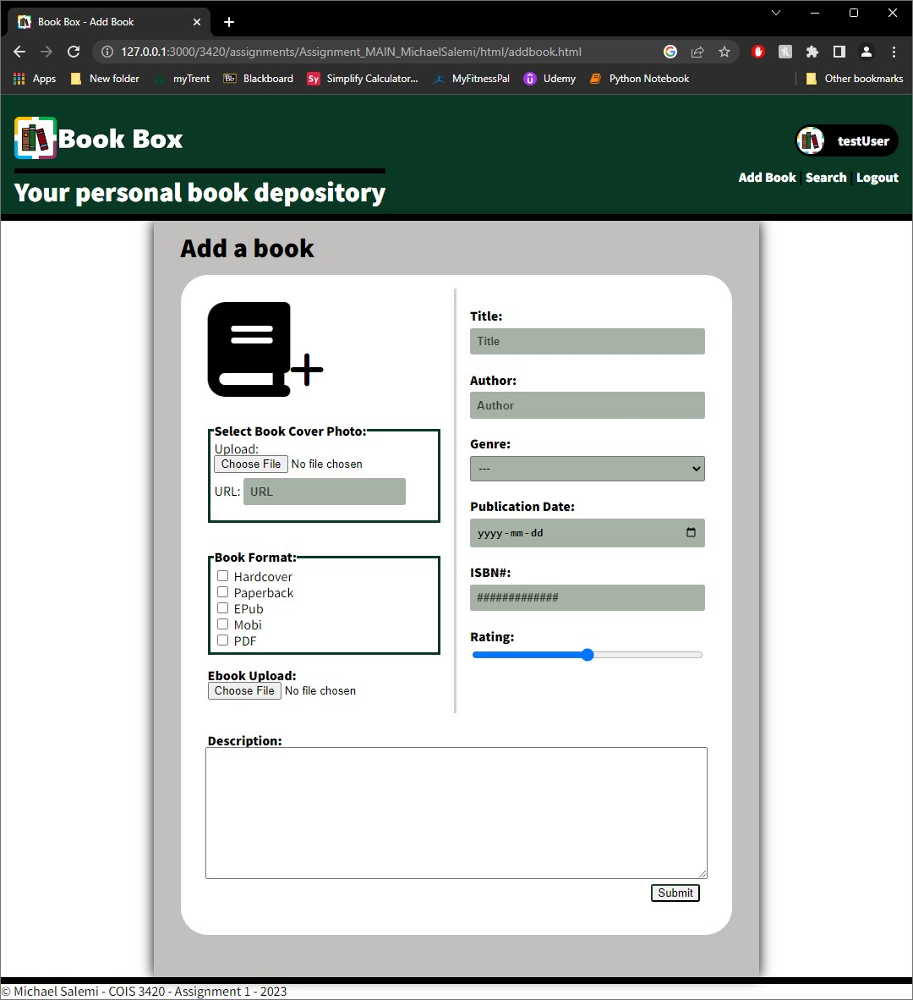
No issues

##### Safari

No issues

##### Firefox
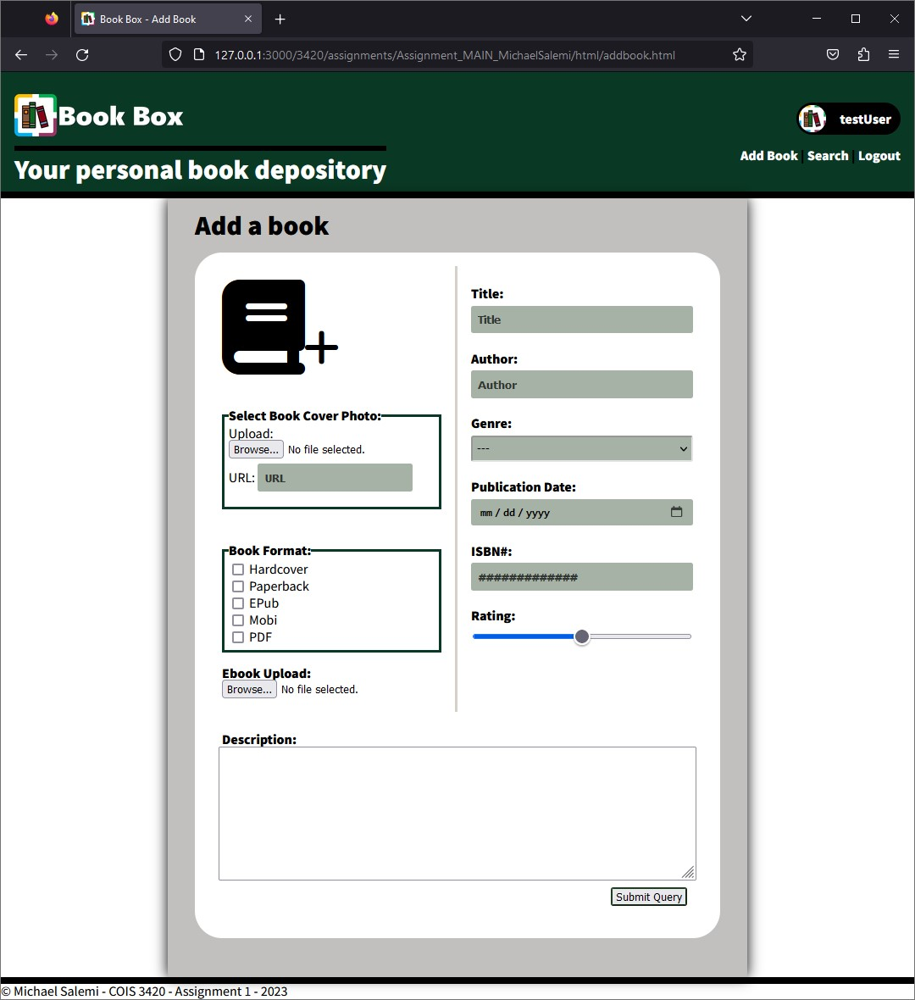
No issues


## Display Details

### HTML

```html
<!--
details.html
-displays detailed information of book selected from search or from homepage
-currently placeholder with hardcoded details of one book
-->
<!DOCTYPE html>
<html lang="en">

<head>
    <meta charset="UTF-8">
    <title>Book Box - Details</title>
    <link rel="icon" type="image/x-icon" href="../images/bookBoxIcon.ico">
    <link rel="stylesheet" href="../styles/main.css">
</head>

<body>
    <header>
        <div id="headerTitle">
            <a href="./index.html"></a>
            <h2>Your personal book depository</h2>
        </div>
        <div id="headerBox2">
            <a href="">
                
                <h3>testUser</h3>
            </a>
            <nav>
                <div><a href="./addbook.html">Add Book</a> | <a href="./search.html">Search</a> | <a
                        href="./login.html">Logout</a>
                </div>
            </nav>
        </div>

    </header>
    <main>
        <h2>The Catcher in the Rye</h2>
        <div id="contentBox">
            <div class="bookbox">
                <div style="align-items: center">
                    
                    <nav>
                        <div><a href="./addbook.html">Edit</a> <a href="">Delete</a></div>
                    </nav>
                </div>
                <div>
                    <h3>Title:</h3> The Catcher in the Rye
                    <h3>Author:</h3> J. D. Salinger
                    <h3>ISBN#:</h3> 978-7543321724
                    <h3>Genre:</h3> Other
                    <h3>Rating:</h3> 3.5
                    <h3>Formats:</h3> Hardcover, Paperback, PDF
                </div>
            </div>


            <div class="">
                <h3 style="align-self: start">Description:</h3>
                <p> The Catcher in the Rye, novel by J.D. Salinger published in 1951. The novel details two days
                    in the life of 16-year-old Holden Caulfield after he has been expelled from prep school.
                    Confused and disillusioned, Holden searches for truth and rails against the “phoniness” of the
                    adult world.</p>
            </div>
        </div>
    </main>
    <footer>
        <span>&copy; Michael Salemi - COIS 3420 - Assignment 1 - 2023</span>
    </footer>
</body>

</html>
```

### Testing

#### HTML Validation
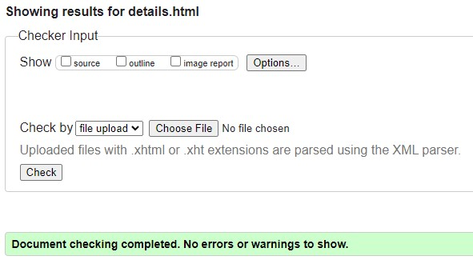

#### Browser testing

##### Edge
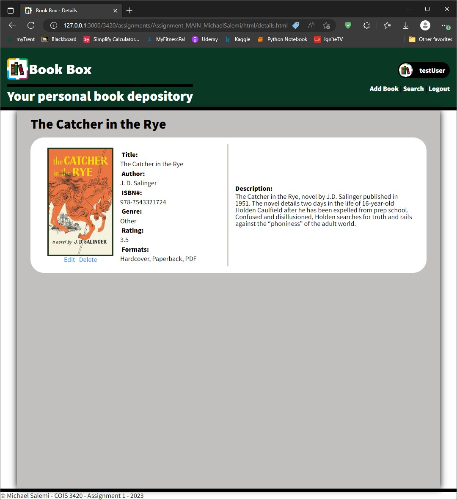
No issues

##### Chrome
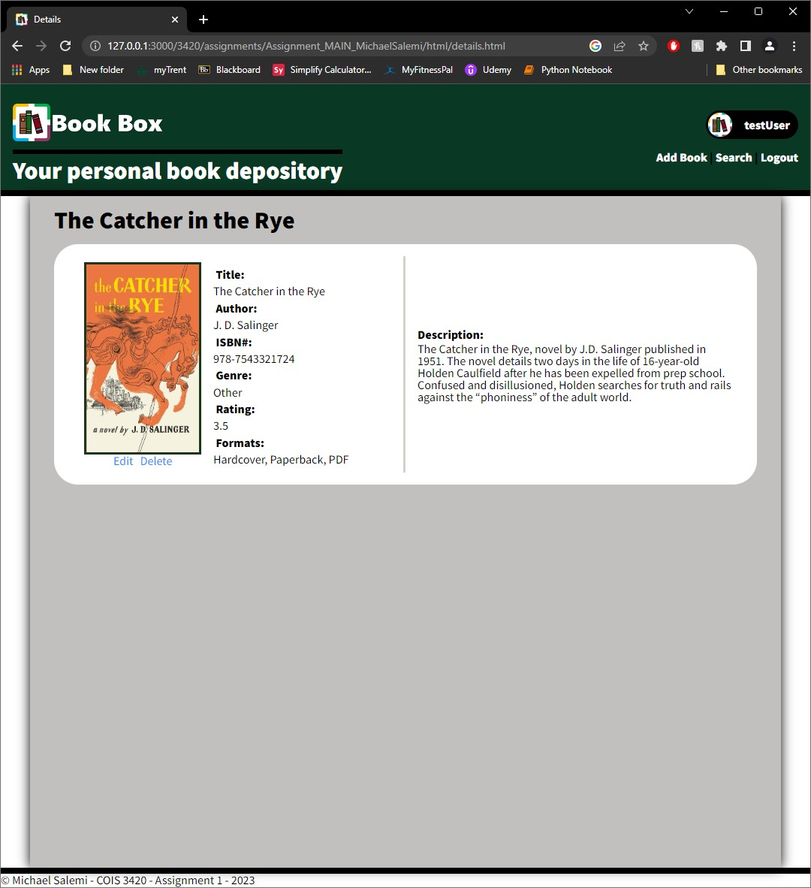
No issues

##### Safari

No issues

##### Firefox
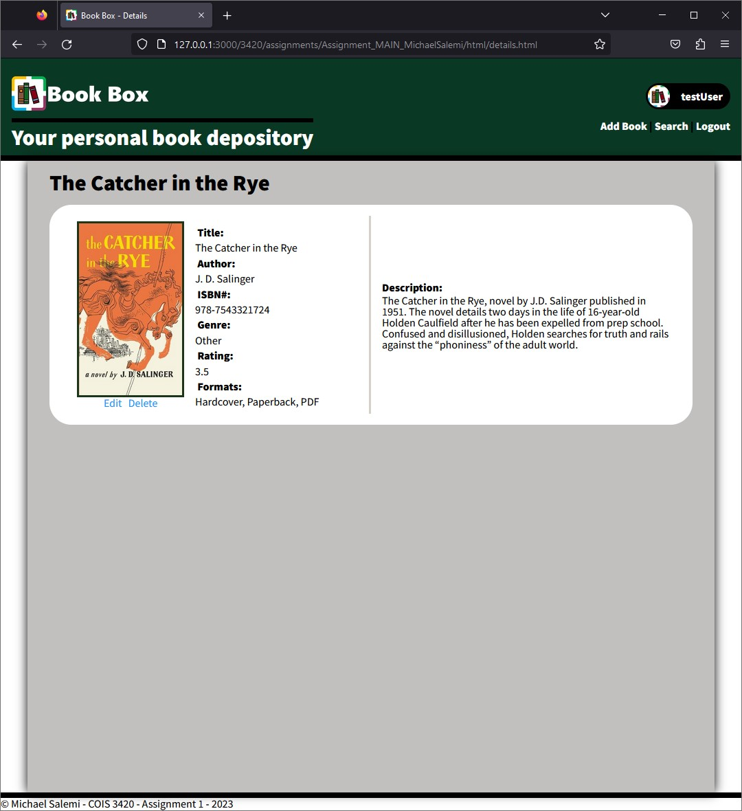
No issues

## Search

### HTML

```html
<!--
search.html
-allows users to search their collection based on fields that were originally used to save book
-results will be selectable to send to the details page
-->
<!doctype html>
<html lang="en">

<head>
    <meta charset="UTF-8">
    <title>Book Box - Search</title>
    <link rel="icon" type="image/x-icon" href="../images/bookBoxIcon.ico">
    <link rel="stylesheet" href="../styles/main.css">

</head>

<body>
    <header>
        <div id="headerTitle">
            <a href="./index.html"></a>
            <h2>Your personal book depository</h2>
        </div>
        <div id="headerBox2">
            <a href="">
                
                <h3>testUser</h3>
            </a>
            <nav>
                <div><a href="./addbook.html">Add Book</a> | <a href="./search.html">Search</a> | <a
                        href="./login.html">Logout</a>
                </div>
            </nav>
        </div>
    </header>
    <main>
        <h2>Search</h2>
        <form action="future.php" method="post" id="searchFields">
            <div>
                <div><label for="title">Title:</label></div>
                <div><input type="text" id="title" name="Title" placeholder="Title"></div>
                <div><label for="author">Author:</label></div>
                <div><input type="text" id="author" name="author" placeholder="Author"></div>
                <div><label for="genre"> Genre:</label></div>
                <select name="genre" id="genre">
                    <option selected disabled>---</option>
                    <option value="mystery">Mystery</option>
                    <option value="sci_fi">Sci-Fi</option>
                    <option value="romance">Romance</option>
                    <option value="non_fiction">Non-Fiction</option>
                    <option value="educational">Educational</option>
                    <option value="history">History</option>
                    <option value="other">Other</option>
                </select>
            </div>
            <div>
                <div><label for="rating">Rating:</label></div>
                <input type="range" id="rating" name="rating" min="1" max="5" step="0.5" value="3">
                <div><label for="isbn">ISBN#:</label></div>
                <div><input type="text" id="isbn" name="isbn" placeholder="#############"
                        pattern="^[0-9]{10}|[0-9]{13}$">
                </div>
                <input type="submit">
            </div>
        </form>
        <div id="contentBox">
            <!--submit form to future php-->
            <div class="bookbox">
                
                <div>
                    <h3>Title:</h3>
                    <h4>The Catcher in the Rye</h4>
                    <h3>Author:</h3>
                    <h4>J. D. Salinger</h4>
                    <h3>ISBN#:</h3>
                    <h4>9787543321724</h4>
                    <h3>Genre:</h3>
                    <h4>Other</h4>
                    <!--page options-->
                    <nav>
                        <div><a href="./details.html">Details</a> <a href="./editbook.html">Edit</a> <a
                                href="">Delete</a>
                        </div>
                    </nav>
                </div>
            </div>
            <div class="bookbox">
                
                <div>
                    <h3>Title:</h3>
                    <h4>The Catcher in the Rye</h4>
                    <h3>Author:</h3>
                    <h4>Mark Twain</h4>
                    <h3>ISBN#:</h3>
                    <h4>9798633894530</h4>
                    <h3>Genre:</h3>
                    <h4>Other</h4>
                    <!--page options-->
                    <nav>
                        <div><a href="./details.html">Details</a> <a href="./editbook.html">Edit</a> <a
                                href="">Delete</a>
                        </div>
                    </nav>
                </div>
            </div>
            <div class="bookbox">
                
                <div>
                    <h3>Title:</h3>
                    <h4>Crack the Coding Interview</h4>
                    <h3>Author:</h3>
                    <h4>Gayle Laakmann McDowell</h4>
                    <h3>ISBN#:</h3>
                    <h4>9780984782857</h4>
                    <h3>Genre:</h3>
                    <h4>Educational</h4>
                    <!--page options-->
                    <nav>
                        <div><a href="./details.html">Details</a> <a href="./editbook.html">Edit</a> <a
                                href="">Delete</a>
                        </div>
                    </nav>
                </div>
            </div>
            <div class="bookbox">
                
                <div>
                    <h3>Title:</h3>
                    <h4>The Book of Mormon</h4>
                    <h3>Author:</h3>
                    <h4>Joseph Smith</h4>
                    <h3>ISBN#:</h3>
                    <h4>9781453771860</h4>
                    <h3>Genre:</h3>
                    <h4>Non-Fiction</h4>
                    <nav>
                        <a href="./details.html">Details</a> <a href="./addbook.html">Edit</a> <a href="">Delete</a>
                    </nav>
                </div>
            </div>
        </div>
    </main>
    <footer>
        <span>&copy; Michael Salemi - COIS 3420 - Assignment 1 - 2023</span>
    </footer>
</body>

</html>
```

### Testing

#### HTML Validation
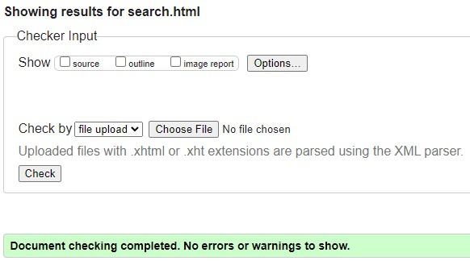
#### Browser testing

##### Edge

No issues

##### Chrome
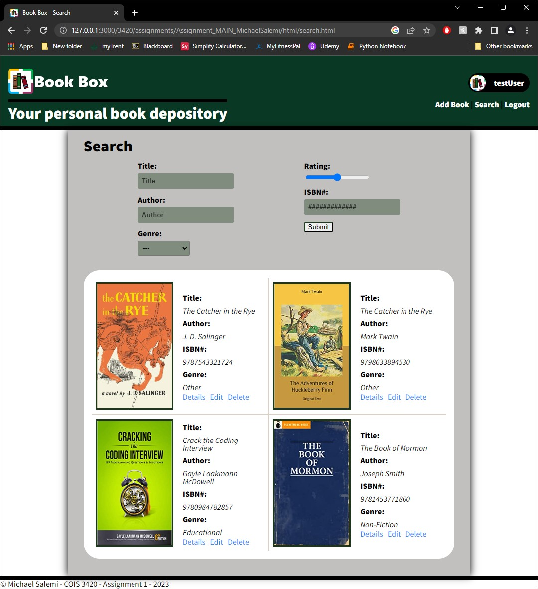
No issues

##### Safari

No issues

##### Firefox
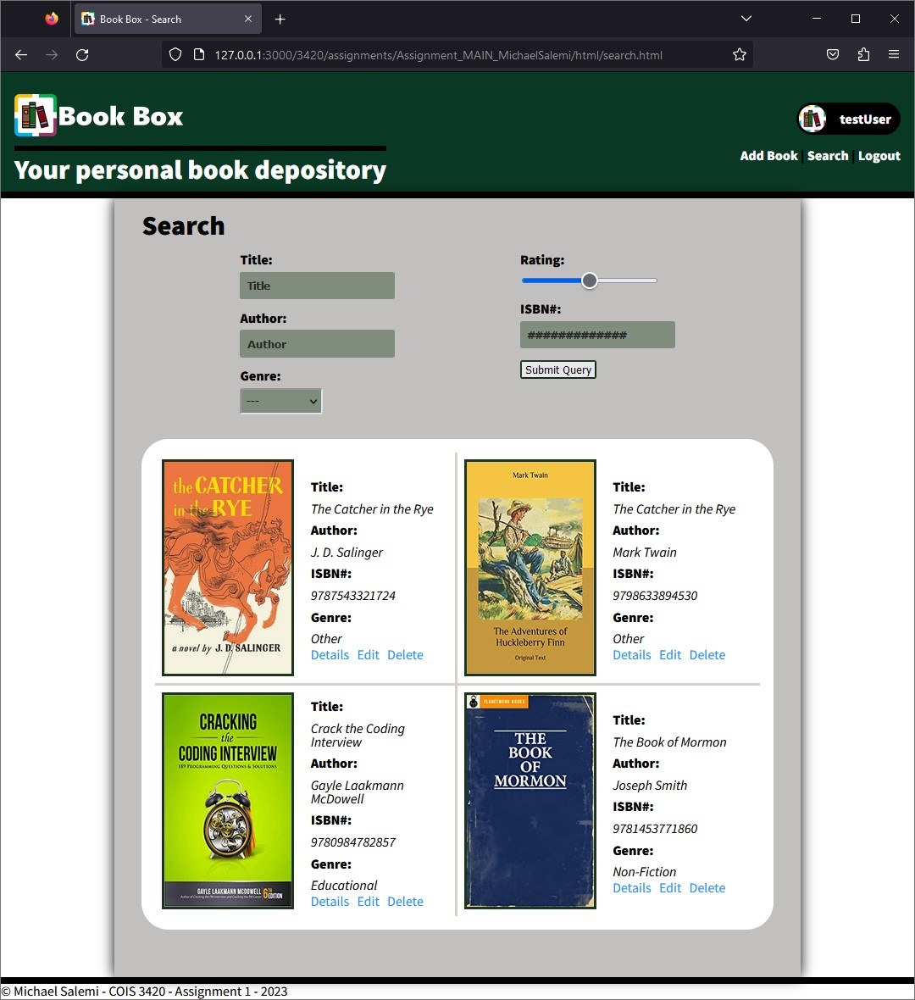
No issues

## Styles

### main.css

```css
@import url("reset.css");

@import url('https://fonts.googleapis.com/css2?family=Source+Sans+Pro:ital,wght@0,300;0,400;0,900;1,400&display=swap');


/**************************/
/* Styling for all pages' consistent content */
/************************/
:root {
    font-family: "Source Sans Pro";
    background-color: white;
}

hr {
    height: 0.2em;
    background-color: dimgray;
    border-radius: 0.2em;
    border: none;
}

body {
    display: flex;
    flex-direction: column;
    min-height: 100vh;
    min-width: 700px;
}

main {
    flex: auto;
    flex-direction: column;
    align-self: center;
    background-color: #C1C0BE;
    max-width: 1000px;
    min-width: 500px;
    height: 80%;

    box-shadow: 0 0 1em black;
}

#headerTitle>a>img {
    margin-top: 0.5em;
    transition: all .1s ease-in-out;
}

#headerTitle>a>img:hover {
    transform: scale(1.1);
}

#headerBox2>a>div {
    display: flex;
    flex-direction: row;
    align-items: center;
}

#headerBox2>a:hover {
    transition: all .1s ease-in-out;
    transform: scale(1.1);
}

main>h2 {
    font-size: 2em;
    font-weight: bold;
    margin: 0.5em 1em;
}

header {
    display: flex;
    background-color: #093824;
    justify-content: space-between;
    align-items: center;
    padding: 0.6em 1em;
    border-bottom: 0.5em solid black;
    font-weight: bold;
}

#headerTitle {
    justify-items: left;
    font-size: 2em;
    color: white;
    align-items: start;
}

#headerBox2 {
    align-items: end;
}

#headerTitle h2 {
    padding-top: 0.2em;
    border-top: solid black 0.2em;
}

#headerTitle h1 {
    -webkit-text-stroke: 0.01em white;
    font-size: 2em;
}

#headerBox2>a {
    margin-bottom: 1em;
}

header>div {
    display: flex;
    flex-direction: column;
}

#headerBox2>a,
#headerBox2>a:hover,
#headerBox2>a:visited {
    text-decoration: none;
    color: white;
    display: flex;
    align-items: center;
    align-content: center;
    background-color: black;
    padding-right: 0.5em;
    border: solid black 0.2em;
    border-radius: 2em;
}

#headerBox2>a:hover {
    border-color: white;
}

#headerBox2 nav a:hover {
    color: #BC222C;
}

#headerBox2 nav a {
    text-decoration: none;
    color: white;
}

#headerTitle img {
    height: 50px;
    margin-bottom: 0.2em;
}

#headerBox2 img {
    width: 2em;
    height: 2em;
    border-radius: 50%;
    background-color: white;
    margin-right: 1em;
}

main>div {
    display: flex;
    justify-content: center;
    align-items: center;
    margin: 1em;
}

main>div>h2 {
    font-weight: bold;
    font-size: 2em;
    margin-left: 1em;
}

footer {
    border-top: 0.5em solid black;
    height: 18px;
}

/************/
/* contentBox is white box holding content on all pages */
/************/
#contentBox {
    display: grid;
    flex-direction: column;
    border: 1em solid transparent;
    background-color: white;
    border-radius: 2em;
    grid-template-columns: 50% 50%;
    margin: 1em 2em 2em 2em;
}

#contentBox>div {
    display: flex;
    flex-direction: column;
    padding: 1em;
}

#contentBox>div:last-child,
#contentBox>div:nth-last-child(2):nth-child(odd) {
    border-bottom: none;
}

#contentBox>div:nth-child(odd) {
    border-right: solid #D6D0C9;
}

#contentBox>div:last-child {
    border-right: none;
}

#contentBox h3 {
    font-weight: bold;
    font-size: 1em;
    margin: 0.2em 0;
}

/*******************/
/* .bookbox class is specific to details, search, index to
display book information in grid */
/*******************/
.bookbox {
    display: flex;
    align-items: center;
    justify-content: left;
    flex-direction: column;
}

.bookbox img {
    border: solid #1B361B;
    /*padding: 1em 0;*/
}

.bookbox>div {
    display: flex;
    flex-direction: column;
    justify-content: space-evenly;
    margin-left: 1em;
    height: auto;
    min-height: 60%;
}

.bookbox>div h3 {
    padding: 0.2em;
    font-weight: bold;
}

.bookbox>div h4 {
    padding: 0.2em;
    font-style: italic;
}

.bookbox a,
form a {
    text-decoration: none;
    color: dodgerblue;
    border: .2em solid transparent;
}

.bookbox nav a:hover,
form a:hover {
    color: #BC222C;
}

#contentBox>.bookbox {
    border-bottom: solid #D6D0C9;
    padding: 0.5em;
    flex-direction: row;
    display: flex;
}

#description {
    width: 100%;
}

.doubleGrid {
    display: flex;
    flex-direction: column;
    grid-column: 1 / span 2;
    align-items: center;
    justify-content: center;
}

.doubleGrid input {
    margin: 0.5em;
}

/***************/
/* form specific styling */
/***************/
#searchFields {
    display: flex;
    margin: 1em 0;
    flex-direction: row;
    justify-content: space-evenly;
}

fieldset label {
    font-weight: normal;
}

fieldset {
    display: flex;
    flex-direction: column;
    margin: 1em 0;
}

input::placeholder {
    color: black;
    font-weight: bold;
    opacity: 70%;
}

input[type="text"],
input[type="password"],
input[type="date"],
input[type="url"],
input[type="email"] {
    border: solid transparent;
    font-weight: bold;
    border-radius: 0.2em;
    color: black;
    background-color: rgba(30, 63, 30, 0.4);
    padding: 0.4em;
    margin-top: 0.5em;
    margin-bottom: 1em;
}

input[type="text"]:hover,
input[type="password"]:hover,
input[type="date"]:hover,
input[type="url"]:hover,
input[type="email"]:hover {
    border-color: #093824;
}

option {
    color: black;
}

select::selection {
    color: #BC222C;
}

select {
    padding: 0.4em;
    border-radius: 0.2em;
    background-color: rgba(30, 63, 30, 0.4);
    margin-top: 0.5em;
    margin-bottom: 1em;
}

input[type="range"] {
    margin-top: 0.5em;
    margin-bottom: 1em;
}

input[type=submit] {
    border-radius: 0.2em;
    border-color: rgb(30, 63, 30);
}

input[type=submit]:hover {
    color: white;
    background-color: cornflowerblue;
}

label,
legend {
    margin-top: 0.5em;
    font-weight: bold;
}

fieldset {
    border: solid 0.2em #093824;
    padding: 0.3em;
}
```

### reset.css
included just incase...\
*NOT MY WORK*

```css
/* 
   ***************
   * NOT MY WORK *
   ***************
   http://meyerweb.com/eric/tools/css/reset/
   v2.0 | 20110126
   License: none (public domain)
*/

html,
body,
div,
span,
applet,
object,
iframe,
h1,
h2,
h3,
h4,
h5,
h6,
p,
blockquote,
pre,
a,
abbr,
acronym,
address,
big,
cite,
code,
del,
dfn,
em,
img,
ins,
kbd,
q,
s,
samp,
small,
strike,
strong,
tt,
var,
b,
u,
i,
center,
dl,
dt,
dd,
ol,
ul,
li,
fieldset,
form,
label,
legend,
table,
caption,
tbody,
tfoot,
thead,
tr,
th,
td,
article,
aside,
canvas,
details,
embed,
figure,
figcaption,
footer,
header,
hgroup,
menu,
nav,
output,
ruby,
section,
summary,
time,
mark,
audio,
video {
  margin: 0;
  padding: 0;
  border: 0;
  font-size: 100%;
  font: inherit;
  vertical-align: baseline;
}
/* HTML5 display-role reset for older browsers */
article,
aside,
details,
figcaption,
figure,
footer,
header,
hgroup,
menu,
nav,
section {
  display: block;
}
body {
  line-height: 1;
}
ol,
ul {
  list-style: none;
}
blockquote,
q {
  quotes: none;
}
blockquote:before,
blockquote:after,
q:before,
q:after {
  content: "";
  content: none;
}
table {
  border-collapse: collapse;
  border-spacing: 0;
}
```

